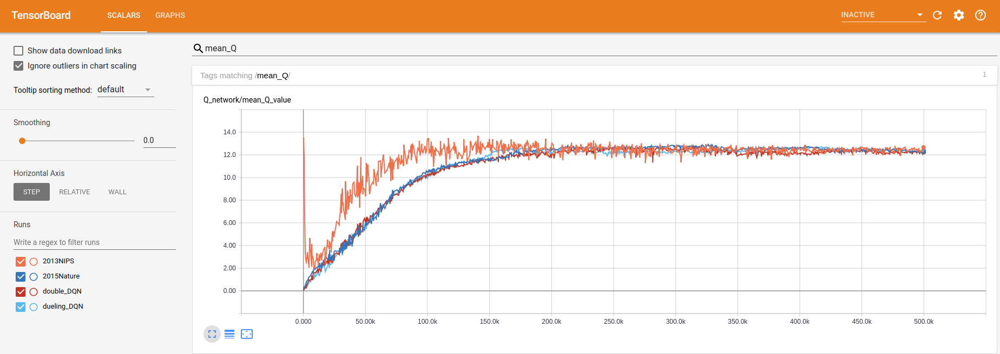
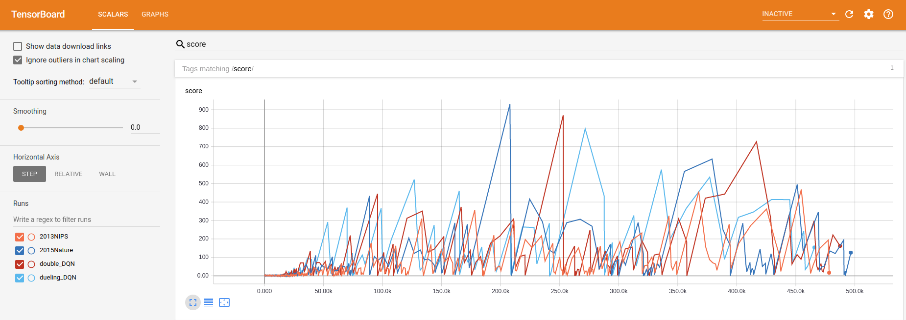

# Deep Q-networks for flappy bird

## Roadmap
- [x] Implement 2013 NIPS paper's DQN(with replay buffer)
- [x] Implement 2015 Nature paper's DQN(add the target network)
- [x] Implement double DQN
- [x] Implement Dueling DQN

## Results
Each approach both played about 500k frame in my computer.

| approach | mean score | highest score |
| -------- | ---------------------- | ------------- |
| 2013NIPS | 20.534 | 468 |
| 2015Nature | 25.121 | 931 |
| double_DQN | 31.530 | 870 |
| dueling_DQN | 30.520 | 797 |

**The score here cannot strictly represent the pros and cons of the algorithm.**

You can download the [trained model and logs](https://drive.google.com/drive/folders/1BDwjBMUV1OeRRtFZbgt5wOaoeX2zig9-?usp=sharing)

The change of mean Q value:



The change of score:


## Requirements
- tensorflow
- pygame
- opencv
``` shell
pip install tensorflow pygame opencv-python
```

## How to run
``` shell
git clone https://github.com/FLming/DQN_flappy_bird.git
cd DQN_flappybird
python flappybird.py
```

change the approach just change the code in flappybird.py e.g.

``` python
from double_DQN import DeepQNetworks 
from DQN_Nature import DeepQNetworks
```

if you wanna see network architecture, the change of variables and scores.

``` shell
tensorboard --logdir logs
```

if you wanna speed traning up, comment FPSCLOCK.tick(FPS) in wrapped_flappy_bird.py or add FPS

## Reference
- repo: [floodsung/DRL-FlappyBird](https://github.com/floodsung/DRL-FlappyBird)
- repo: [openai/baselines/deepq](https://github.com/openai/baselines/tree/master/baselines/deepq)
- repo: [MorvanZhou/Reinforcement-learning-with-tensorflow](https://github.com/MorvanZhou/Reinforcement-learning-with-tensorflow)