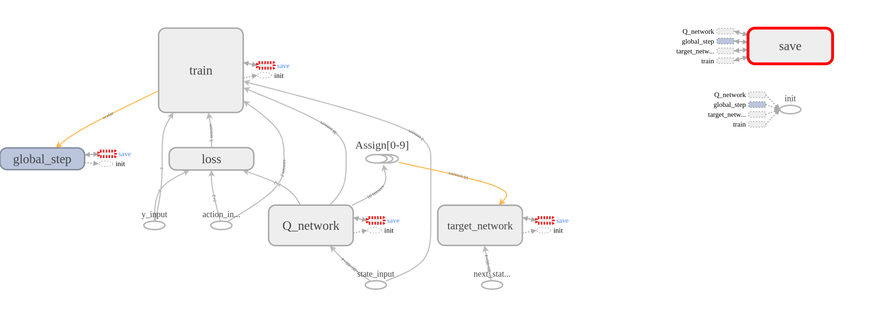

# Deep Q-networks for flappy bird
## Roadmap
- [x] Implement 2013 NIPS paper's DQN(with replay buffer)
- [x] Implement 2015 Nature paper's DQN(add the target network)
- [x] Implement double DQN
- [ ] Implement others DQN such as Dueling DQN...
## Architecture now: 

## Requirements
- tensorflow
- pygame
- opencv
``` shell
pip install tensorflow pygame opencv-python
```
## Demo
``` shell
git clone https://github.com/FLming/DQN_flappy_bird.git
cd DQN_flappybird
python flappybird.py
```
change the approach just change the code in flappybird.py e.g.
``` python
from double_DQN import DeepQNetworks 
from DQN_Nature import DeepQNetworks
```
if you wanna see network architecture, the change of variables and scores.
``` shell
tensorboard --logdir logs
```
if you wanna speed traing up, comment FPSCLOCK.tick(FPS) in wrapped_flappy_bird.py or add FPS
## Reference
- repo: [floodsung/DRL-FlappyBird](https://github.com/floodsung/DRL-FlappyBird)
- repo: [openai/baselines/deepq](https://github.com/openai/baselines/tree/master/baselines/deepq)
- repo: [MorvanZhou/Reinforcement-learning-with-tensorflow](https://github.com/MorvanZhou/Reinforcement-learning-with-tensorflow)